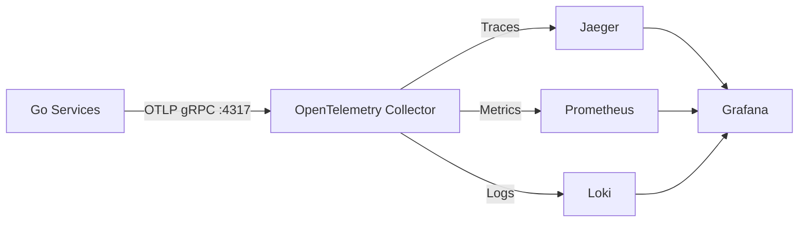

# Observability Stack

OpenTelemetry + Jaeger + Prometheus + Loki + Grafana observability stack.

## Architecture



**Core Design**:
- All telemetry data (Traces, Metrics, Logs) is sent to the Collector via the **OTLP protocol**.
- No need for file collectors like Promtail; applications push data directly via the SDK.

## Service List

| Service | Port | Usage |
|------|------|------|
| OpenTelemetry Collector | 4317 (gRPC), 4318 (HTTP) | Telemetry data collector |
| Jaeger | 16686 | Distributed tracing UI |
| Prometheus | 9090 | Time-series database |
| Loki | 3100 | Log storage |
| Grafana | 3000 | Unified visualization platform |

## Quick Start

### 1. Start the Monitoring Stack

```bash
cd deploy/docker/observability
docker-compose up -d
```

### 2. Verify Service Status

```bash
docker-compose ps
```

All services should be in the `Up` state.

### 3. Configure Application Connection

Ensure that your service configuration file (`.env` or `config.yaml`) is set to:

```yaml
telemetry:
  endpoint: "localhost:4317"  # Local development
  # endpoint: "otel-collector:4317"  # Docker environment
```

### 4. Access Grafana

- URL: http://localhost:3000
- Default Username: `admin`
- Default Password: `admin`

**Pre-configured Data Sources**:
- Prometheus (Default)
- Loki
- Jaeger

## Verify Data Flow

### Verify Traces

1. Access Jaeger UI: http://localhost:16686
2. Select a service (e.g., `gateway`)
3. Click "Find Traces"

### Verify Metrics

1. Access Prometheus: http://localhost:9090
2. Example Query: `http_server_request_duration_bucket`

### Verify Logs

1. Select the Loki data source in Grafana.
2. Example Query: `{service_name="gateway"}`
3. Clicking on the `trace_id` in the logs should navigate to the corresponding Trace.

## Troubleshooting

### Collector Cannot Receive Data

Check Collector logs:
```bash
docker logs otel-collector
```

Check the count of received data:
```bash
curl http://localhost:8888/metrics | grep otelcol_receiver_accepted
```

### Grafana Cannot Query Data

1. Check data source configuration: Grafana → Configuration → Data Sources
2. Test connection: Click the "Test" button.
3. Check if backend services are healthy:
   ```bash
   curl http://localhost:9090/-/healthy  # Prometheus
   curl http://localhost:3100/ready      # Loki
   curl http://localhost:16686/          # Jaeger
   ```

## Directory Structure

```
observability/
├── docker-compose.yml
├── grafana/
│   └── provisioning/
│       └── datasources/
│           └── datasource.yaml      # Data source configuration
├── loki/
│   └── loki-config.yaml
├── otel-collector/
│   └── config.yaml                   # Collector configuration
└── prometheus/
    └── prometheus.yml
```

## Production Suggestions

1. **Security**:
   - Change the default Grafana password.
   - Enable TLS.

2. **Persistence**:
   - Mount external volumes to persist data.
   - Configure a backup strategy.

3. **Resource Limits**:
   - Adjust `deploy.resources.limits`.
   - Adjust Prometheus retention based on load.

4. **High Availability**:
   - Use Kubernetes for deployment.
   - Configure multiple replicas.
