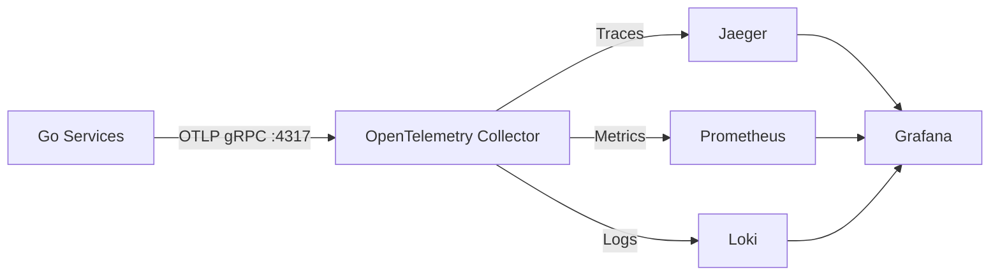

# Observability Stack

OpenTelemetry + Jaeger + Prometheus + Loki + Grafana 可观测性栈。

## 架构



**核心设计**：
- 所有遥测数据（Traces、Metrics、Logs）通过 **OTLP 协议**发送到 Collector
- 无需 Promtail 等文件采集器，应用直接通过 SDK 推送数据

## 服务列表

| 服务 | 端口 | 用途 |
|------|------|------|
| OpenTelemetry Collector | 4317 (gRPC), 4318 (HTTP) | 遥测数据收集器 |
| Jaeger | 16686 | 分布式追踪 UI |
| Prometheus | 9090 | 时序数据库 |
| Loki | 3100 | 日志存储 |
| Grafana | 3000 | 统一可视化平台 |

## 快速开始

### 1. 启动监控栈

```bash
cd deploy/docker/observability
docker-compose up -d
```

### 2. 验证服务状态

```bash
docker-compose ps
```

所有服务应该处于 `Up` 状态。

### 3. 配置应用连接

确保你的服务配置文件（`.env` 或 `config.yaml`）中设置：

```yaml
telemetry:
  endpoint: "localhost:4317"  # 本地开发
  # endpoint: "otel-collector:4317"  # Docker 环境
```

### 4. 访问 Grafana

- URL: http://localhost:3000
- 默认账号: `admin`
- 默认密码: `admin`

**已预配置的数据源**：
- Prometheus（默认）
- Loki
- Jaeger

## 验证数据流

### 验证 Traces

1. 访问 Jaeger UI: http://localhost:16686
2. 选择服务（例如 `gateway`）
3. 点击 "Find Traces"

### 验证 Metrics

1. 访问 Prometheus: http://localhost:9090
2. 查询示例: `http_server_request_duration_bucket`

### 验证 Logs

1. 在 Grafana 中选择 Loki 数据源
2. 查询示例: `{service_name="gateway"}`
3. 点击日志中的 `trace_id` 应该能跳转到对应的 Trace

## 故障排查

### Collector 无法接收数据

检查 Collector 日志：
```bash
docker logs otel-collector
```

检查接收的数据计数：
```bash
curl http://localhost:8888/metrics | grep otelcol_receiver_accepted
```

### Grafana 无法查询到数据

1. 检查数据源配置: Grafana → Configuration → Data Sources
2. 测试连接: 点击 "Test" 按钮
3. 检查后端服务是否正常:
   ```bash
   curl http://localhost:9090/-/healthy  # Prometheus
   curl http://localhost:3100/ready      # Loki
   curl http://localhost:16686/          # Jaeger
   ```

## 目录结构

```
observability/
├── docker-compose.yml
├── grafana/
│   └── provisioning/
│       └── datasources/
│           └── datasource.yaml      # 数据源配置
├── loki/
│   └── loki-config.yaml
├── otel-collector/
│   └── config.yaml                   # Collector 配置
└── prometheus/
    └── prometheus.yml
```

## 生产环境建议

1. **安全性**:
   - 修改 Grafana 默认密码
   - 启用 TLS

2. **持久化**:
   - 挂载外部卷以持久化数据
   - 配置备份策略

3. **资源限制**:
   - 调整 `deploy.resources.limits`
   - 根据负载调整 Prometheus 的 retention

4. **高可用**:
   - 使用 Kubernetes 部署
   - 配置多副本
