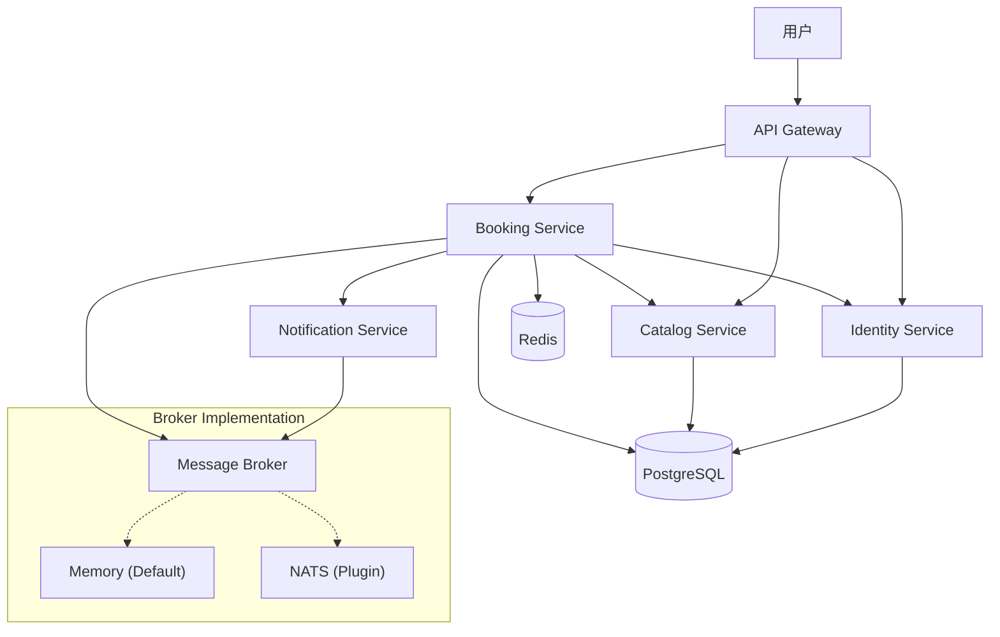

# Business Architecture & Usage Scenarios

## Business Architecture

### System Overview



### Business Flow

#### 1. 用户注册与登录

```
用户 → Gateway → Identity Service
  ├─ 注册: 创建账户 → 生成 JWT Token
  └─ 登录: 验证凭证 → 返回 JWT Token
```

#### 2. 浏览演出信息

```
用户 → Gateway → Catalog Service
  ├─ 查询演出列表（分页、筛选）
  ├─ 查看演出详情（场次、座位区域）
  └─ 检查座位可用性
```

#### 3. 创建订单（核心流程）

```
用户 → Gateway → Booking Service
  ├─ 验证用户身份 (调用 Identity Service)
  ├─ 检查库存 (调用 Catalog Service)
  ├─ 锁定座位 (Redis 分布式锁)
  ├─ 创建订单 (PostgreSQL 事务)
  ├─ 发布订单事件 (Message Broker)
  └─ 返回订单信息
       ↓
  Notification Service (异步)
  └─ 发送订单确认邮件/短信
```

#### 4. 支付与出票

```
用户 → Gateway → Booking Service
  ├─ 调用支付网关
  ├─ 更新订单状态
  ├─ 扣减库存 (调用 Catalog Service)
  ├─ 发布支付成功事件 (Message Broker)
  └─ 生成电子票
       ↓
  Notification Service
  └─ 发送电子票到用户邮箱
```

---

## Usage Scenarios

### Scenario 1: 用户购票完整流程

**背景**: 用户 Alice 想购买周杰伦演唱会的门票

**步骤**:

1. **注册账户**

```bash
POST /api/v1/auth/register
{
  "email": "alice@example.com",
  "password": "SecurePass123",
  "full_name": "Alice Wang"
}

Response:
{
  "user_id": "uuid-1234",
  "access_token": "eyJhbGc...",
  "refresh_token": "eyJhbGc..."
}
```

2. **浏览演出**

```bash
GET /api/v1/shows?city=上海&category=演唱会

Response:
{
  "shows": [
    {
      "show_id": "show-5678",
      "title": "周杰伦 2026 世界巡回演唱会",
      "venue": "上海体育场",
      "date": "2026-08-15"
    }
  ]
}
```

3. **查看场次和座位**

```bash
GET /api/v1/shows/show-5678/sessions

Response:
{
  "sessions": [
    {
      "session_id": "session-001",
      "date": "2026-08-15 19:30",
      "seat_areas": [
        {
          "area_id": "vip-a",
          "name": "VIP A区",
          "price": 1280,
          "available": 45
        }
      ]
    }
  ]
}
```

4. **创建订单**

```bash
POST /api/v1/orders
Authorization: Bearer eyJhbGc...

{
  "session_id": "session-001",
  "seat_area_id": "vip-a",
  "quantity": 2
}

Response:
{
  "order_id": "order-9999",
  "total_amount": 2560,
  "status": "pending_payment",
  "expires_at": "2026-01-14T15:30:00Z"
}
```

5. **完成支付**

```bash
POST /api/v1/orders/order-9999/pay
{
  "payment_method": "alipay",
  "payment_token": "alipay_token_xxx"
}

Response:
{
  "order_id": "order-9999",
  "status": "paid",
  "tickets": [
    {
      "ticket_id": "ticket-001",
      "qr_code": "https://cdn.example.com/qr/ticket-001.png"
    }
  ]
}
```

---

### Scenario 2: 高并发抢票

**背景**: 热门演出开票，10000 人同时抢 100 张票

**系统行为**:

1. **Gateway 层**

   - Rate Limiter: 限制单 IP 每秒最多 10 次请求
   - 请求排队，防止服务过载

2. **Booking Service**

   - Redis 分布式锁: 确保座位不会超卖
   - 乐观锁: 库存扣减使用 CAS 操作
   - 订单超时: 15 分钟未支付自动释放

3. **Catalog Service**
   - 库存预留: 创建订单时预留座位
   - 定时任务: 清理过期预留

**关键代码逻辑**:

```go
// Booking Service - 库存锁定
func (s *BookingService) LockSeats(ctx context.Context, sessionID, areaID string, qty int) error {
    lockKey := fmt.Sprintf("seat_lock:%s:%s", sessionID, areaID)

    // 获取分布式锁
    lock := s.redis.Lock(lockKey, 10*time.Second)
    defer lock.Release()

    // 检查并扣减库存
    available := s.catalogClient.CheckAvailability(ctx, sessionID, areaID)
    if available < qty {
        return ErrInsufficientInventory
    }

    // 创建预留记录
    return s.catalogClient.ReserveSeats(ctx, sessionID, areaID, qty)
}
```

---

### Scenario 3: 订单状态机

**订单生命周期**:

```
Created (已创建)
    ↓
Pending Payment (待支付) ←─┐
    ↓                      │
    ├─ [15分钟超时] → Cancelled (已取消)
    ↓                      │
Paid (已支付)              │
    ↓                      │
    ├─ [用户申请] ────────┘
    ↓
Refunded (已退款)
    ↓
Completed (已完成)
```

**状态转换规则**:

- `Created` → `Pending Payment`: 订单创建成功
- `Pending Payment` → `Paid`: 支付成功
- `Pending Payment` → `Cancelled`: 超时或用户取消
- `Paid` → `Refunded`: 用户申请退款且审核通过
- `Paid` → `Completed`: 演出结束后 7 天

---

### Scenario 4: 服务间调用链路追踪

**请求链路**:

```
Gateway (Request ID: abc-123)
  ↓
Booking Service (继承 Request ID: abc-123)
  ├─→ Identity Service (验证用户)
  │     Log: [abc-123] Validating user uuid-1234
  │
  ├─→ Catalog Service (检查库存)
  │     Log: [abc-123] Checking inventory for session-001
  │
  └─→ Notification Service (发送通知)
        Log: [abc-123] Sending order confirmation email
```

**日志示例**:

```
# Gateway
2026-01-14T15:30:00Z [abc-123] POST /api/v1/orders status=200 latency=245ms

# Booking Service
2026-01-14T15:30:00Z [abc-123] CreateOrder started user=uuid-1234
2026-01-14T15:30:00Z [abc-123] Calling Identity.GetProfile
2026-01-14T15:30:00Z [abc-123] Calling Catalog.CheckAvailability

# Identity Service
2026-01-14T15:30:00Z [abc-123] GetProfile user=uuid-1234 duration=12ms

# Catalog Service
2026-01-14T15:30:00Z [abc-123] CheckAvailability session=session-001 available=45
```
